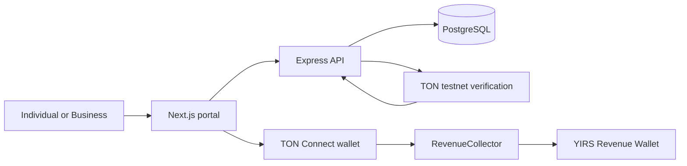

# Architecture

Payment flow: choose the revenue type and assessed amount, prepare a signed `PayRevenue` transaction, submit through TON Connect, verify on the backend, then issue a receipt after confirmation.
